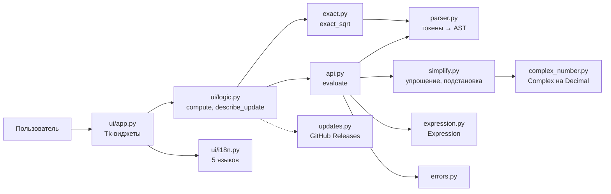

# Техническая документация

## Обзор

SquareRoot — приложение на Python 3.9+ без сторонних зависимостей
(`decimal`, `fractions`, `tkinter`, `urllib`). Состоит из вычислительного ядра
(пакет `squareroot`), которое можно использовать как библиотеку, и
графической оболочки (`squareroot.ui`). Ядро ничего не знает об интерфейсе,
логика интерфейса не импортирует `tkinter` — поэтому всё, кроме отрисовки
виджетов, покрыто тестами без дисплея.



## Модули

| Модуль | Ответственность |
|---|---|
| `complex_number.py` | `Complex(real, imag)` на `Decimal`: арифметика, целые степени (бинарное возведение), главный квадратный корень, модуль, сопряжение, разбор строк вида `3-4i`. `float` запрещён, чтобы не терять точность. |
| `parser.py` | Токенизатор и рекурсивный нисходящий парсер. AST: `Literal`, `Variable`, `UnaryOp`, `BinOp`, `Call`. Ограничения: вложенность ≤ 100, глубина дерева ≤ 150. |
| `simplify.py` | Свёртка констант, алгебраические тождества (`x*1`, `x+0`, `x^1`, `x*0`, `x^0`), `sqrt(x^2k) → abs(x^k)`, `sqrt(x^(2k+1)) → abs(x^k)*sqrt(x)`, подстановка переменных, вывод в строку. |
| `expression.py` | `Expression` — символьный результат с методами `variables`, `substitute`; перевод `decimal.Overflow`/`RecursionError` в ошибки проекта. |
| `api.py` | `evaluate(expression, variables=None, precision=None)` — точка входа. Проверяет точность (1–1000), выставляет `decimal`-контекст. Возвращает `Complex` (число) или `Expression` (если остались свободные переменные). |
| `exact.py` | `exact_sqrt(expression, variables=None)` — точная форма `a·√b/q` для вещественного рационального подкоренного выражения. Вычисляет AST в `Fraction`, выделяет полный квадрат пробным делением. Никогда не бросает исключений: `None`, если точной формы нет. |
| `errors.py` | Иерархия `SquareRootError` с машинным кодом `code` и параметрами `params` для локализации. |
| `updates.py` | Проверка обновлений через GitHub Releases API по запросу пользователя. |
| `ui/i18n.py` | Словари 5 языков, определение языка по локали ОС, перевод ошибок. |
| `ui/logic.py` | Чистая логика GUI: сбор переменных, `compute()` → `ComputeResult`, `describe_update()` → `UpdateMessage`. Ловит любые исключения. |
| `ui/app.py` | Tk-виджеты, меню, фоновая проверка обновлений (поток + `after()`). |

## Публичный API

```python
squareroot.evaluate(expression: str, variables: dict | None = None,
                    precision: int | None = None) -> Complex | Expression
squareroot.exact_sqrt(expression: str, variables: dict | None = None) -> str | None
squareroot.Complex, squareroot.Expression
squareroot.DEFAULT_PRECISION = 28, MIN_PRECISION = 1, MAX_PRECISION = 1000
```

Грамматика выражений:

```
expression := term (('+' | '-') term)*
term       := unary (('*' | '/') unary)*
unary      := ('+' | '-') unary | power
power      := primary ('^' unary)?
primary    := NUMBER | IMAG | IDENT | IDENT '(' expression ')' | '(' expression ')'
функции    : sqrt, abs, conj, re, im   (регистр не важен)
```

## Ключевые алгоритмы

- **Квадратный корень** комплексного числа: главная ветвь,
  `√z = √((|z|+Re z)/2) + i·sign(Im z)·√((|z|−Re z)/2)` в `Decimal` с заданной точностью.
- **Целая степень**: бинарное возведение, `log2(n)` умножений; для оснований
  с модулем 1 и показателем длиннее точности — ошибка `exponent_too_large`
  вместо бесконечного цикла.
- **Точная форма**: `√(p/q) = √(p·q)/q`, `p·q = a²·b`, сокращение `a/q`.
  Результат всегда верен; при большом повторяющемся простом делителе
  (> 10 000) форма может быть не до конца сокращена.
- **Упрощение**: снизу вверх, после подстановки переменных повторное упрощение.

## Ошибки

Все ошибки, которые может вызвать пользователь, — подклассы `SquareRootError`:

| Класс | Коды |
|---|---|
| `TokenizeError` | `invalid_number`, `unexpected_character` |
| `ParseError` | `expected_token`, `unexpected_token` |
| `DivisionByZeroError` | `division_by_zero`, `zero_to_nonpositive_power` |
| `UnknownFunctionError` | `unknown_function` |
| `UnsupportedOperationError` | `non_integer_power_complex_base`, `exponent_too_large` |
| `NumberOverflowError` | `overflow` |
| `ExpressionTooComplexError` | `too_complex` |
| `InvalidPrecisionError` | `invalid_precision` |
| `InvalidVariableValueError` | `invalid_variable_value` |

GUI дополнительно ловит любое непредвиденное исключение и показывает
«Внутренняя ошибка», приложение продолжает работать.

## Данные и состояние

Программа не хранит состояния между запусками: нет файлов настроек, реестра,
кэша, логов. Язык берётся из локали ОС. Сеть — только при ручной проверке
обновлений. Это основа переносимости и полного удаления (см. `README.md`).

## Сборка

PyInstaller (`packaging/pyinstaller/squareroot.spec`): onefile для Windows и
Linux, `.app` в `.dmg` для macOS. CI — `.github/workflows/build.yml`,
подробности в `docs/Build.md`.

## Расширение

- **Новый язык**: добавить код в `LANGUAGES`, словари в `_TOKEN_LABELS`,
  `_ERROR_TYPE_LABELS`, `_ERROR_TEMPLATES`, `TRANSLATIONS`. Тест
  `test_i18n.py` проверит, что все ключи на месте.
- **Новая функция**: запись в `parser._FUNCTIONS`, при необходимости правило в
  `simplify._simplify_call`.
- **Новая ошибка**: подкласс `SquareRootError` + код + перевод на все языки.
