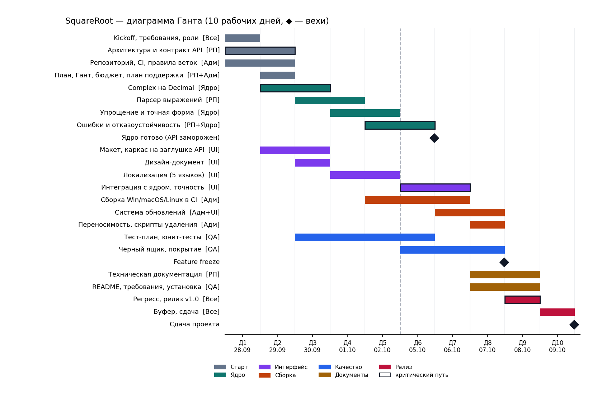
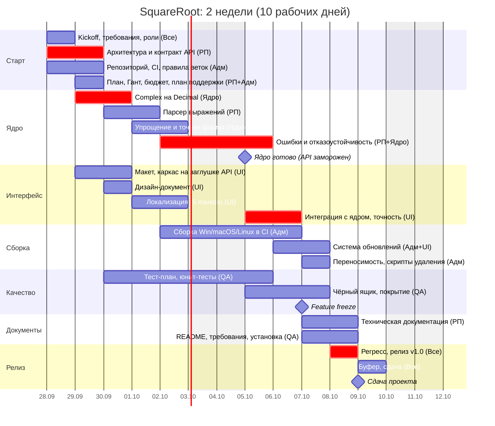

# Управление проектом

Проект: SquareRoot v1.0. Срок: **2 недели = 10 рабочих дней**
(план построен от понедельника 28.09.2026, при другой дате старта сдвигается целиком).
Команда: **5 человек**. Оценки в часах — чистое время на задачу; работа
идёт параллельно, поэтому 138 человеко-часов укладываются в 10 дней при
загрузке ~3 ч в день на человека.

## 1. Персонал и квалификация

| Код | Роль | Обязанности | Требуемая квалификация |
|---|---|---|---|
| РП | Руководитель проекта / архитектор | архитектура и контракт API, парсер, ревью кода, приёмка, техническая документация, решения по объёму работ | Python (middle+), рекурсивный разбор выражений, проектирование API, опыт ведения небольших команд |
| Ядро | Разработчик вычислительного ядра | комплексная арифметика на `Decimal`, произвольная точность, упрощение, точная форма `a√b`, отказоустойчивость | Python (middle), `decimal`/`fractions`, комплексные числа, численные методы, юнит-тесты |
| UI | Разработчик интерфейса и локализации | макет и дизайн, Tkinter, 5 языков, управление точностью, интеграция с ядром | Python (junior+/middle), Tkinter/ttk, основы UX, i18n |
| QA | Инженер по тестированию и документации | тест-план, чёрный/белый ящик, покрытие, пользовательская документация | тест-дизайн (классы эквивалентности, граничные значения), `unittest`, `coverage`, грамотный технический русский/английский |
| Адм | Администратор (инфраструктура и процесс) | репозиторий и доступы, CI/CD GitHub Actions, сборки PyInstaller на 3 ОС, релизы, система обновлений, скрипты удаления, контроль графика по Ганту, трекер задач | GitHub/Git, GitHub Actions, PyInstaller, Windows/macOS/Linux на уровне администратора, shell/PowerShell |

Замещение: РП ↔ Ядро (оба знают ядро), UI ↔ QA (QA знает логику GUI по
тестам), Адм ↔ РП (доступы к репозиторию и релизам есть у обоих).

## 2. Распределение работ

| # | Работа | Исполнитель | Дни | Часы |
|---|---|---|---|---|
| 1 | Kickoff: требования, роли, критерии готовности | все | 1 | 5 × 2 |
| 2 | Архитектура, контракт API (`evaluate`, ошибки с кодами) | РП | 1–2 | 6 |
| 3 | Репозиторий, CI с тестами, правила веток и ревью | Адм | 1–2 | 4 |
| 4 | План, Гант, бюджет, план поддержки | РП + Адм | 2 | 2 + 2 |
| 5 | `Complex` на `Decimal`, корень, степени | Ядро | 2–3 | 8 |
| 6 | Парсер выражений | РП | 3–4 | 8 |
| 7 | Упрощение, точная форма | Ядро | 4–5 | 8 |
| 8 | Ошибки и отказоустойчивость | РП + Ядро | 5–6 | 3 + 3 |
| 9 | Макет и каркас UI на заглушке API | UI | 2–3 | 6 |
| 10 | Дизайн-документ | UI | 3 | 3 |
| 11 | Локализация (ru, en, es, zh, ja) | UI | 4–5 | 6 |
| 12 | Интеграция UI с ядром, управление точностью | UI | 6–7 | 6 |
| 13 | Сборка Windows / macOS / Linux в CI | Адм | 5–7 | 8 |
| 14 | Система обновлений | Адм + UI | 7–8 | 2 + 2 |
| 15 | Переносимость, скрипты полного удаления | Адм | 8 | 3 |
| 16 | Тест-план, юнит-тесты (белый ящик) | QA | 3–6 | 10 |
| 17 | Чёрный ящик, отказоустойчивость, покрытие | QA | 6–8 | 10 |
| 18 | Техническая документация | РП | 8–9 | 4 |
| 19 | README, установка, системные требования | QA | 8–9 | 4 |
| 20 | Регресс, релиз v1.0 | все | 9 | 5 × 2 |
| 21 | Буфер, сдача | все | 10 | резерв |
| — | Ревью кода и приёмка (0,5 ч/день) | РП | 1–8 | 4 |
| — | Разбор найденных QA дефектов | Ядро | 6–8 | 3 |
| — | Ежедневный контроль графика | Адм | 1–10 | 3 |

Итого по людям:

| Роль | Часы |
|---|---|
| РП | 31 |
| Ядро | 26 |
| UI | 27 |
| QA | 28 |
| Адм | 26 |
| **Всего** | **138** |

## 3. Диаграмма Ганта

Та же диаграмма в Mermaid (рисуется на GitHub):

**Критический путь:** контракт API → `Complex` → ошибки → интеграция UI →
регресс → релиз. Задержка на нём сдвигает сдачу; всё остальное имеет запас
до feature freeze (конец дня 8).

## 4. Как уложиться в срок и соблюсти план

1. **Контракт API в первые 2 дня.** UI и QA работают по контракту и заглушке,
   не дожидаясь ядра. Поэтому ядро, интерфейс и тесты идут параллельно.
2. **Приоритеты по MoSCoW.** Must: корень из комплексного числа, точность,
   GUI, 4 языка, сборки, тесты. Should: точная форма `a√b`, проверка
   обновлений. Could: 5-й язык (японский), подпись бинарников. При
   отставании Could и Should режутся первыми, срок не двигается.
3. **CI с первого дня.** Каждый коммит прогоняет тесты на 3 ОС, поэтому
   интеграция к дню 9 не приносит сюрпризов.
4. **Ежедневный стендап 15 минут.** Что сделал, что делаю, что мешает.
   Администратор отмечает % выполнения в трекере и на диаграмме Ганта.
5. **Правило эскалации.** Задача отстаёт больше чем на полдня — РП в тот же
   день перераспределяет её (пары замещения из раздела 1) или урезает объём.
6. **Feature freeze в конце дня 8.** После него только исправления ошибок
   и документация.
7. **Буфер — день 10** (~15% срока) на непредвиденное. Если он не нужен,
   уходит на полировку документации.
8. **Определение готовности (DoD) задачи:** код прошёл ревью, тесты зелёные
   в CI, покрытие не ниже 95%, строки переведены на все языки, документация
   обновлена.

### Риски

| Риск | Вероятность | Мера |
|---|---|---|
| Нет машин с Windows/macOS | высокая | сборка и проверка только на раннерах GitHub Actions |
| Ошибки точности `Decimal` на граничных значениях | средняя | тесты чёрного ящика с эталонами, вычисленными вручную |
| Болезнь участника | средняя | пары замещения, общий доступ к репозиторию |
| Неподписанные сборки блокируются ОС | высокая | инструкция обхода в README, подпись — в роадмапе поддержки |
| Расползание требований | средняя | MoSCoW + feature freeze, решения фиксирует РП |

## 5. Роадмап поддержки

| Когда | Что | Кто | Часы |
|---|---|---|---|
| День 10 | Релиз v1.0.0 | все | — |
| 1-й месяц | Гарантийная поддержка: исправления ошибок, выпуски v1.0.x по мере необходимости | Ядро, Адм | до 8 |
| Ежемесячно | Проверить, что CI зелёный, ответить на issues | Адм | 3 |
| Ежемесячно | Исправление ошибок по issues | Ядро или РП | 2 |
| Раз в квартал | Обновить Python/PyInstaller/раннеры в CI, пересобрать, проверить минимальные ОС | Адм | входит в ежемесячные |
| +3 месяца | v1.1: подпись бинарников Windows/macOS, консольный режим (CLI) | Адм, Ядро | ~12 |
| +6 месяцев | v1.2: сборки Linux aarch64 и Windows ARM | Адм | ~6 |
| Раз в год | Пересмотр поддерживаемых ОС (`SystemRequirements.md`) | РП, Адм | 2 |

Поддерживается только **последняя версия**: исправление выходит новой
версией, пользователь заменяет файл. Подробности обновлений — `docs/Updates.md`.

## 6. Оплата труда

Ставки — ориентировочные для почасовой работы junior/middle-разработчиков
(₽ в час, до налогов).

| Роль | Ставка, ₽/ч | Часы | Сумма, ₽ |
|---|---|---|---|
| РП | 1 500 | 31 | 46 500 |
| Ядро | 1 300 | 26 | 33 800 |
| UI | 1 200 | 27 | 32 400 |
| QA | 1 000 | 28 | 28 000 |
| Адм | 1 100 | 26 | 28 600 |
| **Итого** | | **138** | **169 300** |
| Резерв 15% (буфер, день 10) | | | 25 395 |
| **Фонд оплаты труда** | | | **194 695** |

При оформлении по трудовому договору добавляются страховые взносы
работодателя (~30%): **≈ 253 104 ₽**. По договору ГПХ или с самозанятыми
расчёт другой, итог зависит от формы оформления.

Поддержка: Адм 3 ч + Ядро 2 ч в месяц = **5 900 ₽/мес ≈ 70 800 ₽/год**
(плюс разовые работы v1.1/v1.2 по тем же ставкам).

Схема выплат: 50% после вехи «Ядро готово» (день 6), 50% после сдачи
(день 10), резерв выплачивается пропорционально фактическим часам.
