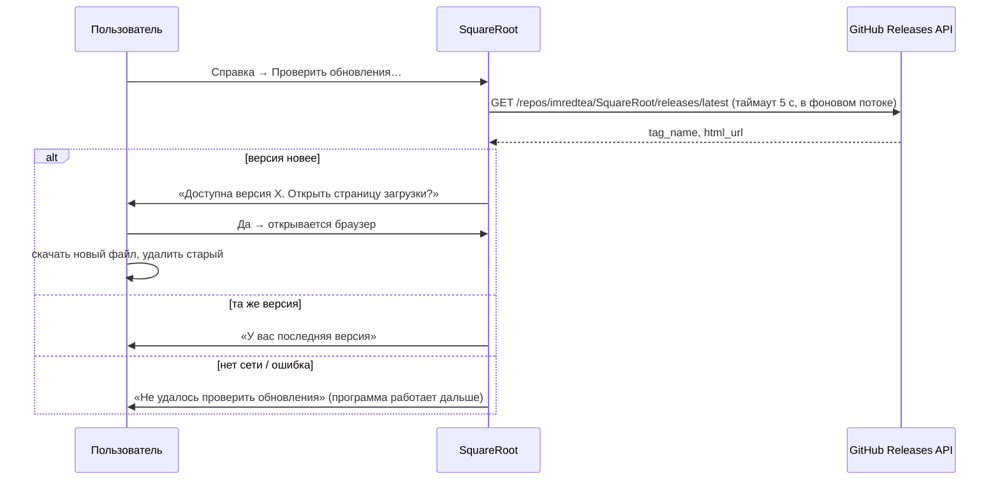

# Система обновлений

## Принцип

Программа — переносимый файл без установщика, поэтому и обновление без
установщика: **новая версия = новый файл**. Автообновления в фоне нет
намеренно: оно требовало бы прав на запись рядом с программой, фоновых
сетевых запросов и хранения состояния, что противоречит требованиям N3/N4
(`Design.md`).

## Как это работает

- Код: `squareroot/updates.py` (`check_for_update`, `parse_version`),
  текст диалогов: `ui/logic.py:describe_update`, все 5 языков.
- Сравнение версий по SemVer: `v1.2.3`, `1.2`, `1.2.3-rc1` → `(1, 2, 3)`.
- Ничего не пишется на диск, никакие данные о пользователе не отправляются
  (только `User-Agent: SquareRoot/<версия>`).
- Если репозиторий переименован или форкнут — поменять `GITHUB_REPO` в
  `updates.py`.

## Выпуск новой версии (для администратора)

1. Обновить `__version__` в `squareroot/__init__.py` по SemVer:
   - `PATCH` (1.0.1) — исправление ошибок;
   - `MINOR` (1.1.0) — новая функциональность без поломки API;
   - `MAJOR` (2.0.0) — несовместимые изменения API.
2. Коммит, затем `git tag v1.0.1 && git push origin v1.0.1`.
3. CI прогоняет тесты на 3 ОС, собирает 4 файла и публикует GitHub Release
   с автоматическими release notes.
4. С этого момента «Проверить обновления» у всех пользователей покажет
   новую версию.

Откат: удалить неудачный Release (или пометить pre-release) — API
`releases/latest` вернёт предыдущую версию.

## Политика поддержки версий

Поддерживается только последняя версия. Старые версии не исправляются:
исправление всегда выходит новой версией, пользователь заменяет файл.
